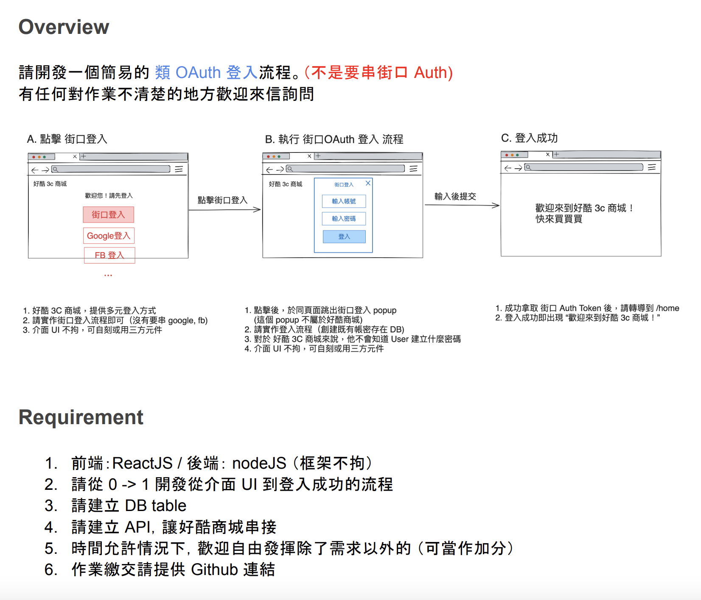

# 街口支付面試-全端工程師試題

## 試題目標

開發一個簡易的 類 OAuth 登入流程。


## 主要技術

- Nextjs v14.2
- React v18.3.1
- Node v18.18.2
- yarn v1.22.17
- Postgresql v14
- Drizzle-ORM v0.30.10
- Docker Compose version v2.24.6-desktop.1

## 運行步驟

### 第一步：初始化依賴項目和環境變數

1. 在根目錄運行
   ```bash
   yarn init
   ```
1. 將根目錄的 `.env.example` 複製到 `packages/db`、`packages/jko-oauth-server`、`packages/jko-resource-server` 並更名為 `.env`

### 第二步：建立資料庫

1. 下載 Docker desktop 並運行
1. 運行 Docker 容器：在根目錄運行
   ```bash
   docker-compose up -d
   ```
1. 建立資料表：在 `packages/db` 運行
   ```bash
   yarn db:push
   ```
1. 建立測試資料：在 `packages/db` 運行
   ```bash
   yarn seed:run
   ```

### 第三步：運行各端伺服器

1. 運行 OAuth 驗證端：在 `packages/jko-oauth-server` 運行
   ```bash
   yarn dev
   ```
1. 運行 Resource 服務端：在 `packages/jko-resource-server` 運行
   ```bash
   yarn dev
   ```
1. 運行 好酷3c商城：在 `packages/socool-3c-shop` 運行
   ```bash
   yarn dev
   ```

### 第四步：運行試題內容

1. 在瀏覽器中打開 [http://localhost:3000](http://localhost:3000)。
1. 測試帳號密碼為
   ```txt
   帳號： customer
   密碼： customer@jko
   ```

### 參考資料

- [The OAuth 2.0 Authorization Framework](https://datatracker.ietf.org/doc/html/rfc6749)
- [Integrating LINE Login with your web app
  ](https://developers.line.biz/en/docs/line-login/integrate-line-login/)
